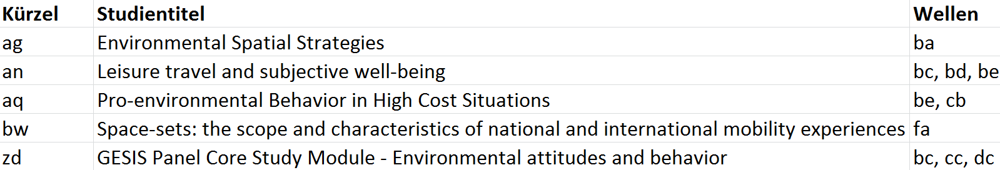
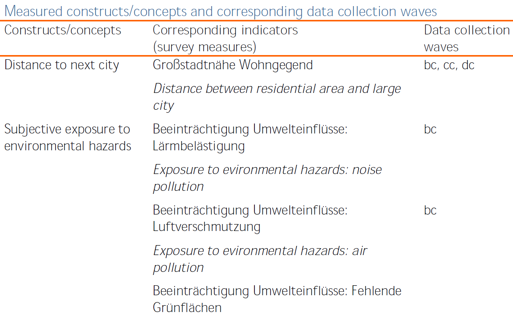
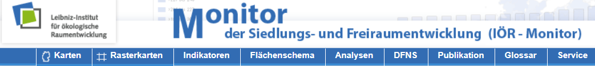
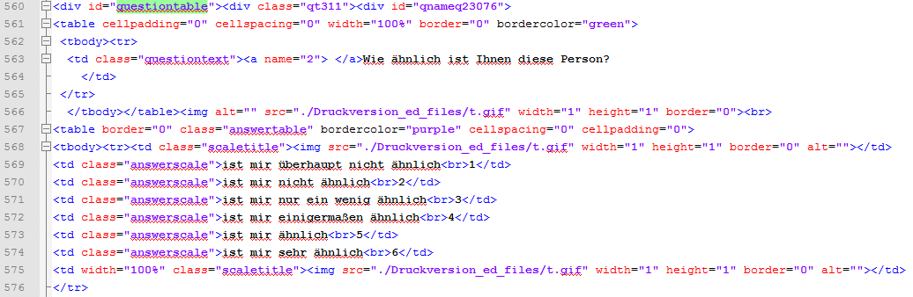
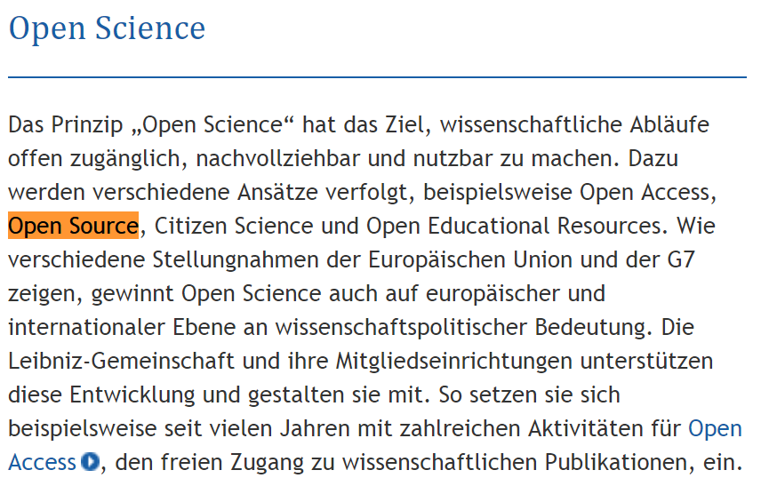
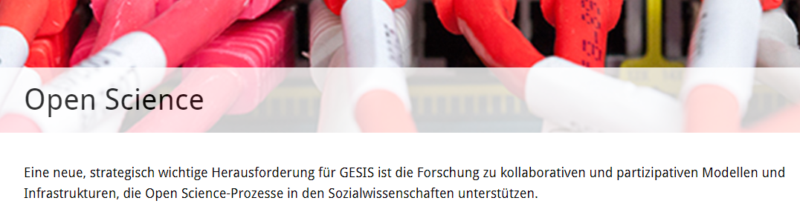
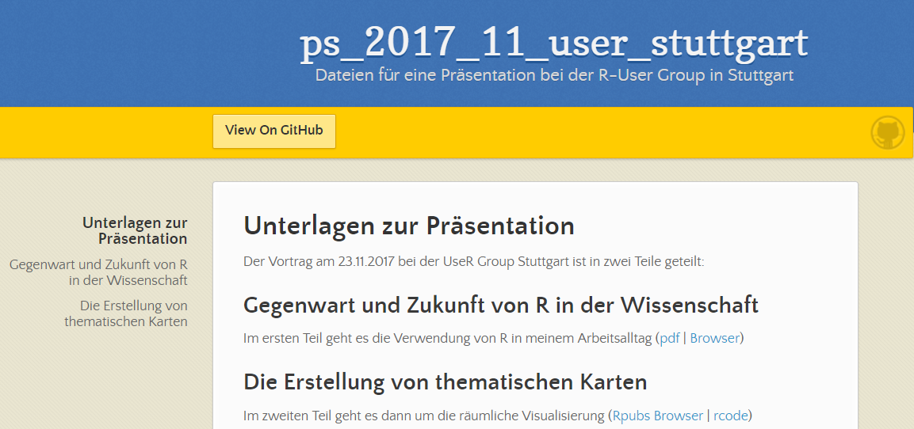

```{r setup, include=FALSE}
# https://stackoverflow.com/questions/38514954/removing-figure-text-in-rmarkdown
knitr::opts_chunk$set(echo = FALSE,warning=F,message = F)
library(knitr)
```

## Biographie

### Über mich

- VWL Studium in Trier (Diplom 2008)
- 2004 Erasmus Jahr an der Université Jean Moulin in Lyon
- Wissenschaftlicher Mitarbeiter am [Lehrstuhl für Wirtschafts- und Sozialstatistik](https://www.uni-trier.de/index.php?id=35894)
- 2012 Promotion (Thema: Die Erzeugung von synthetischen Grundgesamtheiten)
- Seit 2012 am Gesis Leibniz Institut für Sozialwissenschaften - zunächst Team Statistik
- Seit 2017 Survey Statistik im Team Gesis Panel


<!--
## Das Gesis Institut

### Fünf wissenschaftliche Abteilungen

- Datenarchiv für Sozialwissenschaften (DAS)
- Dauerbeobachtung der Gesellschaft (DBG)
- Computational Social Siences (CSS)
- Survey Design and Methodology (SDM)
- Wissenstechnologien für Sozialwissenschaften (WTS)
-->

## Das Gesis Institut 

### Gesis ist:

- Infrastruktureinrichtung für die Sozialwissenschaften
- mit über 250 MitarbeiterInnen an zwei Standorten (Köln und Mannheim)

### GESIS bietet:

- Beratung zu Forschungsprojekten in allen Phasen
- Forschungsbasierte wissenschaftliche Dienstleistungen

## Was ist das Gesis Panel

### Datenerhebungsinfrastruktur

- Probabilistisches mixed-mode Access Panel

- Deutsche Allgemeinbevölkerung
  - Deutschsprachig - ab 18 Jahren
  - Basierend auf Einwohnermeldeamtsstichprobe
- Mehrstufiger Rekrutierungsprozess, sequentielles mixed-mode Design
- Seit 2013 - ca 27 Wellen (alle zwei Monate)
- 2016 Auffrischungsstichprobe

## Überblick Wellen und Studien

- Bisher sind im Gesis Panel in 27 Wellen (aa-bc) ca 77 Studien gelaufen.
- Die Daten sind als [Scientific Use File](https://dbk.gesis.org/dbksearch/sdesc2.asp?db=d&no=5665) (SUF) oder im [Secure Data Center](https://www.gesis.org/angebot/daten-analysieren/weitere-sekundaerdaten/secure-data-center-sdc/) in Köln verfügbar.
- Der SUF der Welle ec umfasst 7599 Beobachtungen und 7874 Variablen
```{r,echo=F,eval=F}
load("data/GP_tab_spat.RData")
kable(tab_spat,row.names = F)
```

```{r,eval=F,echo=F}
library(xlsx)
write.xlsx2(tab_spat,file="data/tab_spat.xlsx")
```




## Beispiel Studie zd *Environmental attitudes and behavior* 
<!--
- Keywords: Environment; Attitudes; Beahavior
-->



## Möglichkeiten Geodaten

- Kooperation mit dem [Leibniz-Institut für ökologische Raumentwicklung](http://www.ioer-monitor.de/startseite/)



- Hier gibt es bspw. Indikatoren zu Nachhaltigkeit, Siedlung, Gebäuden, Verkehr etc. 
- Es könnte also interessant sein, diese Daten an das Gesis Panel anzuspielen
- Aber dazu später mehr

## R Nutzung in meinem Arbeitsalltag 

- Datenaufbereitung

### Was gibts für mich zu tun:

- Panelbereinigung (bei Abmeldung oder Nonresponse)
- Online- und Offline-Daten zusammenführen (Unified Design)
- Anonymisierung und Kategorisierung
- Missings kodieren; bspw. muss sich Filterführung in den Missings wiederspiegeln
- Codebuch und Wellenreport erstellen
- ....

## [R in meinem Arbeitsalltag](https://support.rstudio.com/hc/en-us/articles/201057987-Quick-list-of-useful-R-packages)

- `foreign`, `readstata13` und `xlsx` zum Import von Daten
- Pakete `dplyr` und `tidyr` zur Datenaufbereitung
- `doParallel`, `foreach` und `doSNOW` zur Bearbeitung vieler Jobs
- `Rmarkdown` bei der Datendokumentation (Codebook, Wave Report) 
- `caret` für maschinelles Lernen
- Rstudio git Interface zur Versionskontrolle

## Arbeiten mit HTML Daten

- [Cheatsheet zum Umgang mit Strings](file:///D:/Eigene%20Dateien/Downloads/strings.pdf)



## Genutzte Pakete für das Arbeiten mit Geodaten

- Paket `tmap` zur Erstellung thematischer Karten
- Paket `raster` um Rasterdaten zu verarbeiten und zum Transfer zwischen [Koordinatenreferenzsystemen](https://de.wikipedia.org/wiki/Koordinatenreferenzsystem)


### Bei Gesis entwickelte Pakete

- Paket zur Nutzung der Zensus 2011 Daten 

```{r,eval=F,echo=T}
devtools::install_github("stefmue/georefum")
```

- Paket zur Nutzung der Overpass API um Daten von OpenStreetMap herunterzuladen

```{r,eval=F,echo=T}
devtools::install_github("Japhilko/gosmd")
```


## [Welche Statistikpakete werden genutzt](http://blog.revolutionanalytics.com/2013/10/r-usage-skyrocketing-rexer-poll.html)


## [Trend Open Science - Leibniz Gemeinschaft](https://www.leibniz-gemeinschaft.de/forschung/open-science/)



## [Trend Open Science - GESIS](https://www.gesis.org/forschung/angewandte-informatik/open-science/)




## [Die Nennung von R in Stellenausschreibungen](http://blog.revolutionanalytics.com/2017/02/job-trends-for-r-and-python.html)


## Zwischenfazit - Zukunft von R in der Wissenschaft

- Insgesamt wird mehr quantitativ gearbeitet
- Bedeutung von SPSS nimmt ab
- Bedeutung von R scheint zu steigen - R wird auch mehr und mehr an Hochschulen eingesetzt
- Im Zuge der Open Science Entwicklung wird die Nutzung von R (bei Leibniz Instituten) immer mehr gefördert
- Stata ist nach wie vor wichtig (Pfadabhängigkeit)
- Der große Vorteil von R ist die Flexibilität und die große Nutzer Comunity

## So gehts weiter

https://japhilko.github.io/ps_2017_11_user_stuttgart/




<!--
http://sharpsightlabs.com/blog/r-recommend-data-science/

http://r4stats.com/articles/popularity/

https://www.kdnuggets.com/2013/12/poll-results-r-leading-python-gaining.html
-->
