# Motivation - [Deutschlands größte Klimasünder](http://www.spiegel.de/wissenschaft/mensch/deutschland-das-sind-die-groessten-klimasuender-a-1178207.html)

- Spiegel Artikel am 16.11.2017 aus Anlass der Jamaika Gespräche

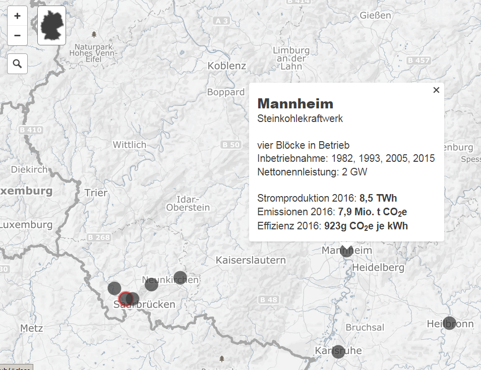


# Gliederung

- Quellen für Polygonzüge (Staaten, Gemeinden, PLZ Bereiche etc.)
- Quellen für inhaltliche Daten
- Pakete zur Erstellung thematischer Karten (bspw. Pakete `maptools`, `sp`, `tmap`)
- Verknüpfung von Daten
- Beispiele für die Darstellung in Karten
 
<!--
Beim letzten Punkt colour Picker einbauen - Folien maps
-->


# Quellen für Polygonzüge


# Hello World


```r
library(maps)
map()
```

 


# Das Paket `maps` - etwas detailierter


Grenzen sind recht grob:


```r
map("world", "Germany")
```

 


<!--
Die Befehle im Paket maps sind etwas anders als bei den anderen Paketen.
-->

# Das Paket `maps` - Mehr Information

- Nur für manche Staaten bekommt man Umkreise für Einheiten unterhalb der Staatsgrenze (bspw. Frankreich, USA). 


```r
data(world.cities)
map("france")
map.cities(world.cities,col="blue")
```

 


# Das Paket `maptools`

- Das Paket `maptools` hat intuitivere Bedienung, zudem können Shapefiles verarbeitet werden.


```r
library(maptools)
data(wrld_simpl)
plot(wrld_simpl,col="royalblue")
```

 

# Was sind shapefiles (`.shp`)?

- Das Dateiformat Shapefile ist ein ursprünglich für die Software ArcView der Firma ESRI entwickeltes Format für Geodaten. (Quelle: [Wikipedia](https://de.wikipedia.org/wiki/Shapefile))


```r
head(wrld_simpl@data)
```


      FIPS   ISO2   ISO3    UN  NAME                     AREA    POP2005   REGION   SUBREGION       LON       LAT
----  -----  -----  -----  ---  --------------------  -------  ---------  -------  ----------  --------  --------
ATG   AC     AG     ATG     28  Antigua and Barbuda        44      83039       19          29   -61.783    17.078
DZA   AG     DZ     DZA     12  Algeria                238174   32854159        2          15     2.632    28.163
AZE   AJ     AZ     AZE     31  Azerbaijan               8260    8352021      142         145    47.395    40.430
ALB   AL     AL     ALB      8  Albania                  2740    3153731      150          39    20.068    41.143
ARM   AM     AM     ARM     51  Armenia                  2820    3017661      142         145    44.563    40.534
AGO   AO     AO     AGO     24  Angola                 124670   16095214        2          17    17.544   -12.296


```r
length(wrld_simpl)
```

```
## [1] 246
```

```r
nrow(wrld_simpl@data)
```

```
## [1] 246
```

# Einzelne Elemente des Datensatzes plotten


```r
ind <- which(wrld_simpl$ISO3=="DEU")
```


```r
plot(wrld_simpl[ind,])
```

 


```r
wrld_simpl@data[ind,]
```

```
##     FIPS ISO2 ISO3  UN    NAME  AREA  POP2005 REGION SUBREGION   LON   LAT
## DEU   GM   DE  DEU 276 Germany 34895 82652369    150       155 9.851 51.11
```


# Das R-Paket `choroplethrMaps`


```r
library(ggplot2);library(choroplethrMaps)
data(country.map)
ggplot(country.map, aes(long, lat, group=group))+ 
  geom_polygon()
```

 

# Eine Karte für die USA


```r
data(state.map)
ggplot(state.map,aes(long,lat,group=group))+geom_polygon()
```

 

# Andere Quellen für Shapefiles - Das Paket `raster`

- Für Polygonzüge unterhalb der Staatsgrenzen ist [Global Administrative Boundaries](http://www.gadm.org/) eine gute Quelle.
- Vor allem wegen API, die man Paket `raster` nutzen kann.


```r
library(raster)
LUX1 <- getData('GADM', country='LUX', level=1)
plot(LUX1)
```

 

# Daten für das Luxemburg Beispiel


```r
head(LUX1@data)
```


 OBJECTID   ID_0  ISO   NAME_0        ID_1  NAME_1         HASC_1    CCN_1  CCA_1   TYPE_1     ENGTYPE_1   NL_NAME_1   VARNAME_1            
---------  -----  ----  -----------  -----  -------------  -------  ------  ------  ---------  ----------  ----------  ---------------------
        1    131  LUX   Luxembourg       1  Diekirch       LU.DI        NA          District   District                Dikrech|Dikkrich     
        2    131  LUX   Luxembourg       2  Grevenmacher   LU.GR        NA          District   District                Gréivemaacher        
        3    131  LUX   Luxembourg       3  Luxembourg     LU.LU        NA          District   District                Lëtzebuerg|Luxemburg 


# [Shapefiles bei Eurostat](http://ec.europa.eu/eurostat/de/web/gisco/geodata/reference-data/administrative-units-statistical-units)

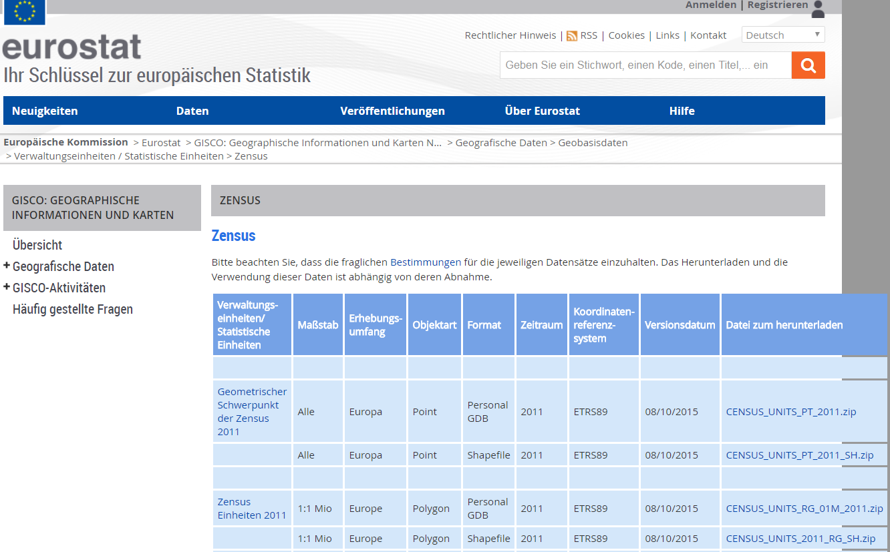


# BKG - Quelle für Kreise in Deutschland

- Umrisse von 402 Kreisen in Deutschland
- Quelle: [Bundesamt für Kartographie und Geodäsie](http://www.geodatenzentrum.de/geodaten/gdz_rahmen.gdz_div?gdz_spr=deu&gdz_akt_zeile=5&gdz_anz_zeile=1&gdz_unt_zeile=15&gdz_user_id=0) (BKG)
- Karten gibt es auch für Bundesländer und Gemeinden


```r
library(maptools)
krs <- readShapePoly("vg250_ebenen/vg250_krs.shp")
plot(krs)
```


```r
head(krs@data$RS)
```

```
## [1] 03401 03458 09473 05962 10046 05916
## 402 Levels: 01001 01002 01003 01004 01051 01053 01054 01055 01056 ... 16077
```

# Die Kreise für Baden-Württemberg

- Systematik hinter dem Amtlichen Gemeindeschlüssel (AGS) bzw. Regionalschlüssel (RS) bei [Wikipedia](https://de.wikipedia.org/wiki/Amtlicher_Gemeindeschl%C3%BCssel)


```r
BLA <- substr(krs@data$RS,1,2)
plot(krs[BLA=="08",])
```

 

# [Shapefiles für Wahlkreise](https://www.bundeswahlleiter.de/bundestagswahlen/2017/wahlkreiseinteilung/downloads.html)


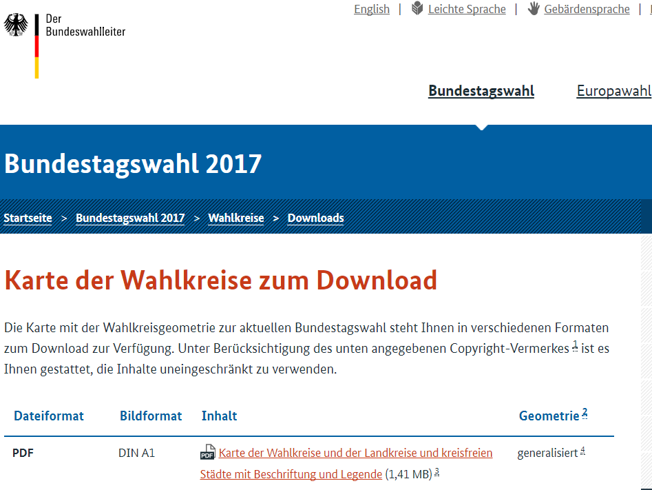


# Ortsnetzbereiche

Quelle: [Bundesnetzagentur](https://www.bundesnetzagentur.de/DE/Sachgebiete/Telekommunikation/Unternehmen_Institutionen/Nummerierung/Rufnummern/ONRufnr/ON_Einteilung_ONB/ON_ONB_ONKz_ONBGrenzen_Basepage.html)

<!-- 
ggf. noch mal neu herunterladen

https://www.bundesnetzagentur.de/SharedDocs/Downloads/DE/Sachgebiete/Telekommunikation/Unternehmen_Institutionen/Nummerierung/Rufnummern/ONVerzeichnisse/ONBGrenzen/ONB-Grenzen-2017.zip;jsessionid=E4247BF20DD015E0722196351E0DC163?__blob=publicationFile&v=14
--> 


```r
onb <- readShapePoly("onb_grenzen.shp")
```


```r
head(onb@data)
```


     VORWAHL   NAME                   KENNUNG 
---  --------  ---------------------  --------
0    04651     Sylt                   NA      
1    04668     Klanxbüll              NA      
2    04664     Neukirchen b Niebüll   NA      
3    04663     Süderlügum             NA      
4    04666     Ladelund               NA      
5    04631     Glücksburg Ostsee      NA      


# Karte der Vorwahlbereiche


# Einen größeren Vorwahlbereich ausschneiden


```r
vwb <- as.character(onb@data$VORWAHL)
vwb1 <- substr(vwb, 1,2)
vwb7 <- onb[vwb1=="07",]
plot(vwb7)
```

 


# Das Paket `rgdal`

- Postleitzahlenbereiche - <http://arnulf.us/PLZ>


```r
library(rgdal)
```


```
## OGR data source with driver: ESRI Shapefile 
## Source: "post_pl.shp", layer: "post_pl"
## with 8270 features
## It has 3 fields
```


```r
library(rgdal)
PLZ <- readOGR ("post_pl.shp","post_pl")
```

# PLZ-Bereiche in Stuttgart


```r
SG <- PLZ[PLZ@data$PLZORT99=="Stuttgart",]
plot(SG,col="chocolate1")
```

 

# PLZ-Bereiche in Berlin


```r
BE <- PLZ[PLZ@data$PLZORT99%in%c("Berlin-West",
              "Berlin (östl. Stadtbezirke)"),]
plot(BE,col="chocolate2",border="lightgray")
```

 

<!--
# Die Grenzen anders einfärben
https://gis.stackexchange.com/questions/36877/how-do-i-change-the-polygon-fill-color-and-border-color-for-spatialpolygons-obje
-->

# Zwischenfazit - Quellen für Polygonzüge

- In einigen R-Paketen sind Polygonzüge hinterlegt
- Umgang mit den Daten unterscheidet sich
- Am sinnvollsten ist das arbeiten mit Shapefiles (.shp)
- Neben den R-Paketen gibt es zahlreiche weitere Quellen für Polygonzüge.

# Thematische Karten mit R erstellen

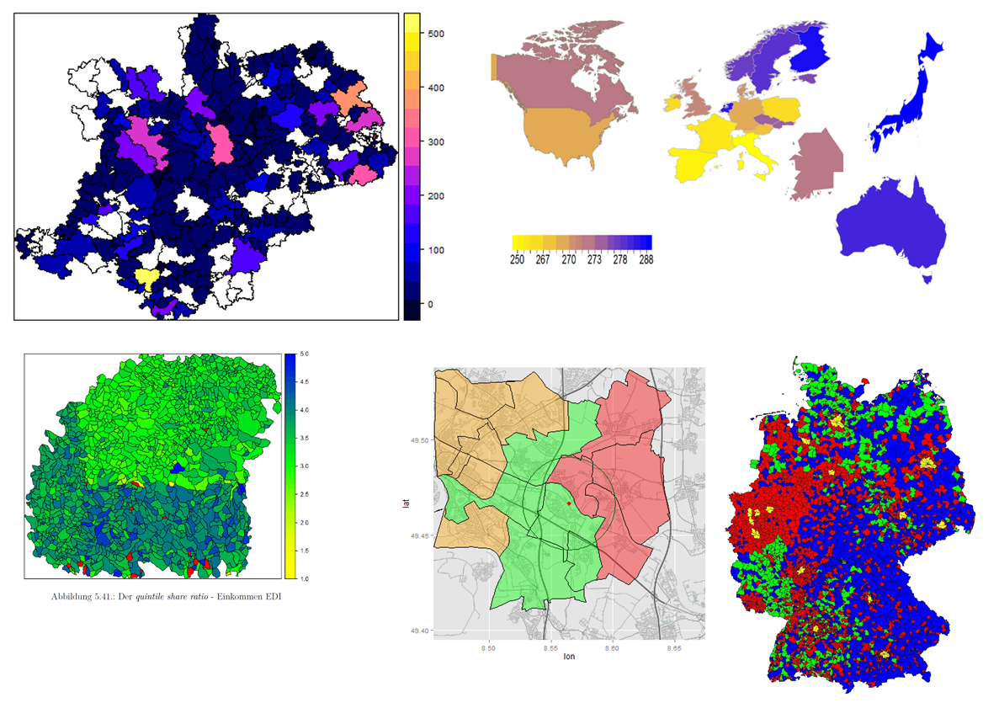

# Thematische Karten erzeugen - das Paket `sp`


```r
library(sp)
spplot(wrld_simpl,"POP2005")
```

 

# Andere Einfärbungen wählen - Das Paket `colorRamps`


```r
library(colorRamps)
spplot(wrld_simpl,"POP2005",col.regions=blue2red(100))
```

 

# Es gibt auch noch mehr Farbverläufe im Paket `colorRamps`

- `blue2green`, `blue2yellow`


```r
spplot(wrld_simpl,"POP2005",col.regions=matlab.like(100))
```

 

# Thematische Karten mit dem Paket `choroplethr`


```r
library(choroplethr)
data(df_pop_state)
```


```r
head(df_pop_state)
```


region           value
-----------  ---------
alabama        4777326
alaska          711139
arizona        6410979
arkansas       2916372
california    37325068
colorado       5042853

# Eine thematische Karte mit `choroplethr` erstellen


```r
state_choropleth(df_pop_state)
```

 


# [Nur drei Staaten darstellen](http://mirrors.softliste.de/cran/web/packages/choroplethr/vignettes/b-state-choropleth.html)


```r
state_choropleth(df_pop_state,
                 title      = "2012 Population Estimates",
                 legend     = "Population",num_colors = 1,
                 zoom       = c("california", "washington",
                                "oregon"))
```

 

# Eine Karte der US Counties


```r
data(df_pop_county)
county_choropleth(df_pop_county)
```

 


# [Choroplethen Länder](http://mirrors.softliste.de/cran/web/packages/choroplethr/vignettes/d-country-choropleth.html)


```r
data(df_pop_country)
country_choropleth(df_pop_country,
              title      = "2012 Population Estimates",
              legend     = "Population",num_colors = 1,
              zoom       = c("austria","germany",
                             "poland", "switzerland"))
```

 

# Weltbank Daten

- AG.AGR.TRAC.NO - [Agricultural machinery, tractors](https://data.worldbank.org/indicator/AG.AGR.TRAC.NO)


```r
library(WDI) 
WDI_dat <- WDI(country="all",
    indicator=c("AG.AGR.TRAC.NO",
    "TM.TAX.TCOM.BC.ZS"),
    start=1990, end=2000)
```

- Es gibt auch eine Funktion `WDIsearch` mit der man nach Indikatoren suchen kann


```r
head(WDI_dat)
```


iso2c   country       year   AG.AGR.TRAC.NO   TM.TAX.TCOM.BC.ZS
------  -----------  -----  ---------------  ------------------
1A      Arab World    1990           383795                  NA
1A      Arab World    1991           402168                  NA
1A      Arab World    1992           404817                  NA
1A      Arab World    1993           432671                  NA
1A      Arab World    1994           437605                  NA
1A      Arab World    1995           471322                  NA


# Weltkarte mit den Weltbank Daten


```r
choroplethr_wdi(code="SP.DYN.LE00.IN", year=2012,
                title="2012 Life Expectancy")
```

 


# Eurostat Daten

Sie können eine Statistik der Sparquote bei [Eurostat](http://ec.europa.eu/eurostat/web/euro-indicators/peeis) downloaden.

<http://ec.europa.eu/eurostat/web/euro-indicators/peeis>


```r
library(xlsx)
HHsr <- read.xlsx2("data/HHsavingRate.xls",1)
```


geo                        X2012Q3   X2012Q4   X2013Q1   X2013Q2   X2013Q3 
-------------------------  --------  --------  --------  --------  --------
Euro area (19 countries)   9.82      11.86     11.37     16.28     10.34   
EU (28 countries)          8.67      10.92     9.42      14.63     8.38    
Belgium                    12.52     9.33      13.99     19.03     12.07   
Czech Republic             10.16     14.81     9.46      10.44     10.12   
Denmark                    7.04      2.56      10.15     8.44      5.41    
Germany                    15.06     14.77     19.45     16.07     15.2    
Ireland                    15.08     5.38      11.48     17.29     16.24   
Spain                      6.99      11.75     1.57      17.27     6.55    


# [Zensus Ergebnisse](https://www.zensus2011.de/SharedDocs/Aktuelles/Ergebnisse/DemografischeGrunddaten.html)

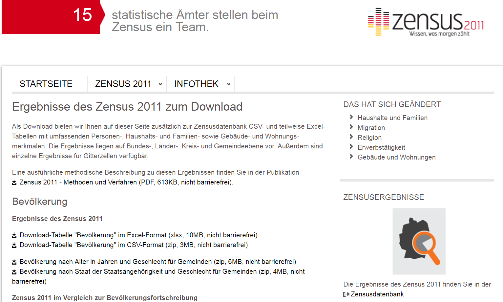


# Zensus Atlas

<https://ergebnisse.zensus2011.de/>


# [Zensus Gemeindeergebnisse](https://www.destatis.de/DE/Methoden/Zensus_/Zensus.html)


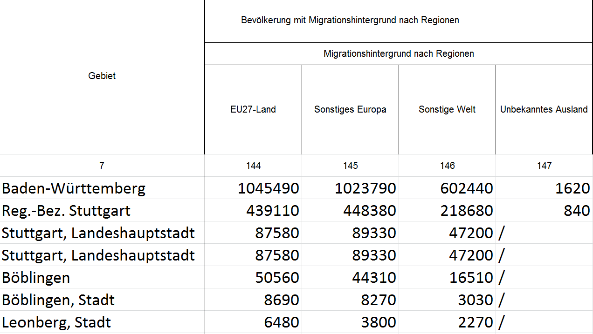

# Beispiel Zensus Daten


```r
zen <- read.csv2("data/Zensus_extract.csv")
# Personen mit eigener Migrationserfahrung
# mit beidseitigem Migrationshintergrund
zen2 <- data.frame(Personen_Mig=zen[,which(zen[9,]==128)],
                   Personen_Mig_bs=zen[,which(zen[9,]==133)])
```


# [datahub.io](datahub.io)


# Weltkulturerbestätten


```r
url <- "https://raw.githubusercontent.com/Japhilko/
GeoData/master/2015/data/whcSites.csv"

whcSites <- read.csv(url) 
```


     name_en          date_inscribed   longitude    latitude   area_hectares  category   states_name_fr 
---  --------------  ---------------  ----------  ----------  --------------  ---------  ---------------
4    Butrint                    1992    20.02611    39.75111              NA  Cultural   Albanie        
6    M'Zab Valley               1982     3.68333    32.48333          665.03  Cultural   Algérie       
7    Djémila                   1982     5.73667    36.32056           30.60  Cultural   Algérie       
8    Timgad                     1982     6.63333    35.45000           90.54  Cultural   Algérie       
27   Fraser Island              1992   153.13333   -25.21667       184000.00  Natural    Australie      


# Exkurs -  [OpenStreetMap](http://www.openstreetmap.de/) Projekt

> OpenStreetMap.org ist ein im Jahre 2004 gegründetes internationales Projekt mit dem Ziel, eine freie Weltkarte zu erschaffen. Dafür sammeln wir weltweit Daten über Straßen, Eisenbahnen, Flüsse, Wälder, Häuser und vieles mehr. 

<http://www.openstreetmap.de/>


](http://wiki.openstreetmap.org/w/images/6/6d/New_York.jpg)

<!--
http://wiki.openstreetmap.org/wiki/Glasgow
-->

# Export von OpenStreetMap Daten

<www.openstreetmap.org/export>


# [OpenStreetMap - Map Features](http://wiki.openstreetmap.org/wiki/Map_Features)

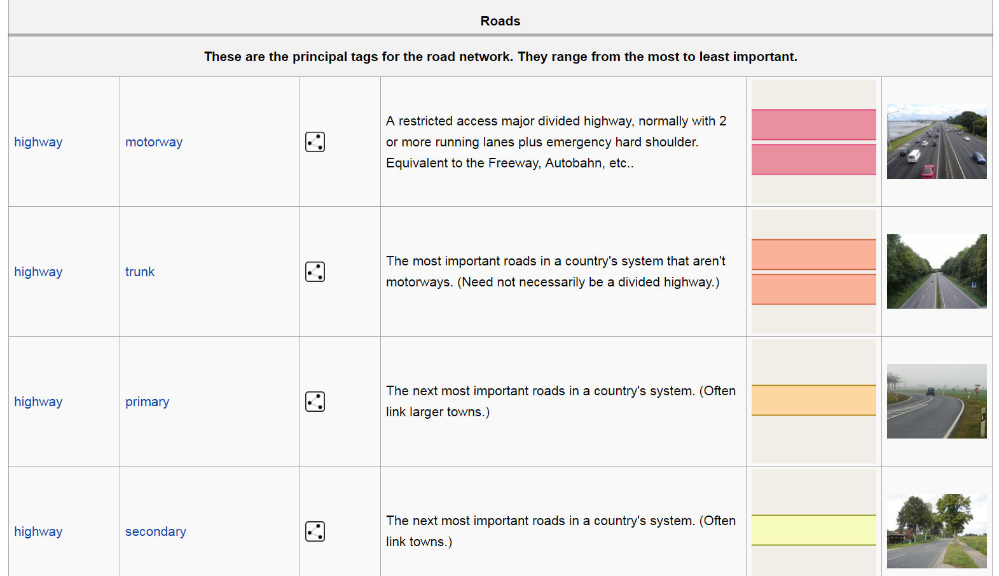


# [Overpass Turbo](https://overpass-turbo.eu/)


# Query Overpass

- Overpass hat eine eigene Abfragesprache

```
node
  [amenity=bar]
  ({{bbox}});
out;
```


# Zwischenfazit - Quellen für inhaltliche Daten

- Gerade auf Staatenebene gibt es sehr viele Daten
- Oftmals hat man aber eigene Daten, die man in einer Karte darstellen möchte
- Frage ist wie sich die inhaltlichen Daten mit den Polygonzügen verbinden lassen


# Verknüpfung von Daten

<!--
http://mjcetce409.blogspot.de/2015/10/
-->


Quelle: [Geographic Information Systems and Remote Sensing](http://mjcetce409.blogspot.de/2015/10/)


# Daten verbinden - Beispiel Eurostat Daten 

- Wir hatten vorhin schon die Haushaltssparrate geladen
- Dabei handelt es sich um einen von den Ausgewählte Wichtigsten Europäische Wirtschaftsindikatoren bei [Eurostat](http://ec.europa.eu/eurostat/web/euro-indicators/peeis) 
- Der Datensatz `wrld_simpl` aus dem Paket `maptools` wird verwendet
- Die Daten werden mit Hilfe des Ländernamens miteinander verknüpft


```r
ind <- match(HHsr$geo,wrld_simpl@data$NAME)
ind <- ind[-which(is.na(ind))]
```

- Der `wrld_simpl` Datensatz wird auf Europa eingeschränkt


```r
EUR <- wrld_simpl[ind,]
```

# Informationen zur Haushaltssparrate

- Informationen zur Haushaltssparrate werden hinzugefügt


```r
EUR@data$HHSR_2012Q3 <- as.numeric(as.character(
  HHsr[-(1:2),2]))
EUR@data$HHSR_2015Q2 <- as.numeric(as.character(
  HHsr[-(1:2),13]))
```


# Karte mit Eurostat Indikator Household Saving Rate

- Mit dem Befehl `spplot` aus dem Paket `sp` ist es möglich zwei Karten nebeneinander darzustellen:


```r
spplot(EUR,c("HHSR_2012Q3","HHSR_2015Q2"))
```

 


# Daten verbinden - Beispiel Bäckereien in Berlin

- Quelle für die folgenden Daten ist: 


<!--
http://wiki.openstreetmap.org/wiki/DE:Datenherkunft_richtig_angeben
-->

# OSM als Datenquelle

- Zum Download habe ich die [Overpass API](http://wiki.openstreetmap.org/wiki/Overpass_API) verwendet


```r
(load("data/info_bar_Berlin.RData"))
```

```
## [1] "info"
```


            addr.postcode   addr.street            name                       lat        lon
----------  --------------  ---------------------  -------------------  ---------  ---------
79675952    13405           Scharnweberstraße     Albert's              52.56382   13.32885
86005430    NA              NA                     Newton Bar            52.51293   13.39123
111644760   NA              NA                     No Limit Shishabar    52.56556   13.32093
149607257   NA              NA                     en passant            52.54420   13.41298
248651127   10115           Bergstraße            Z-Bar                 52.52953   13.39564
267780050   10405           Christburger Straße   Immertreu             52.53637   13.42509


# Verwendung des Pakets `gosmd`


```r
devtools::install_github("Japhilko/gosmd")
```


```r
library("gosmd")
pg_MA <- get_osm_nodes(object="leisure=playground","Mannheim")
pg_MA <- extract_osm_nodes(pg_MA,value='playground')
```


# Matching


```r
tab_plz <- table(info_be$addr.postcode)
```


```r
ind <- match(BE@data$PLZ99_N,names(tab_plz))
ind
```

```
##   [1]  1  2  3  4  5  6  7  8 NA  9 NA NA NA NA NA 10 11 12 NA 13 14 15 16
##  [24] 17 18 19 20 21 22 23 24 25 NA 26 27 28 29 NA NA NA NA 30 NA 31 32 33
##  [47] 34 35 NA NA 36 37 38 39 40 41 42 43 44 45 46 47 48 49 50 51 NA 52 53
##  [70] NA 54 55 NA NA NA 56 57 58 59 60 NA NA NA NA NA 61 NA NA NA 62 NA NA
##  [93] NA NA NA NA NA NA NA 63 NA NA 64 NA 65 NA NA NA 66 NA NA NA NA 67 NA
## [116] NA 68 NA NA NA NA NA NA NA NA NA NA NA NA NA NA NA NA NA NA NA NA NA
## [139] NA 69 70 NA 71 72 73 74 75 NA 76 NA NA NA NA NA NA NA NA NA NA NA NA
## [162] 77 NA 78 79 NA NA NA NA 80 NA NA NA NA 81 NA 82 83 84 NA NA NA NA NA
## [185] NA NA NA 85 NA NA
```

## Daten anspielen


```r
BE@data$num_plz <- tab_plz[ind]
```


# Das Paket `tmap`


```r
library(tmap)
```

- mit `qtm` kann man schnell eine thematische Karte erzeugen


```r
BE@data$num_plz[is.na(BE@data$num_plz)] <- 0
qtm(BE,fill = "num_plz")
```

 

# Mehr Informationen einbinden

- Der folgende Datensatz ist eine Kombination aus den vorgestellten PLZ-Shapefiles und OSM-Daten die über Overpass heruntergeladen wurden:


```r
load("data/osmsa_PLZ_14.RData")
```


     PLZ99    PLZ99_N  PLZORT99   nname             EWZ_gem      area_d   EWZ_gemplz  place_id    osm_type   osm_id   lat          lon          display_name                    class   type    importance  state     city      county     plz2ort   bakery   bar   biergarten   butcher   cafe   chemist   clothes   college   store   food   general   cream   kiosk   mall   pub   restaurant   supermarket   population_density  BLA   gadmbla   gadmkreis    stop   yes  gadmgem   gadmgemtyp         gadmgem2   gadmgemtyp2    ort2plz   ODdat   zenEinw   crossing   bus_stop   street_lamp   traffic_signals   land_cover.index  land_cover.value                           land_cover.description                       elevation.value   temp_Jan   temp_Feb   temp_Mar   temp_Apr   temp_May   temp_Jun   temp_Jul   temp_Aug   temp_Sep   temp_Oct   temp_Nov   temp_Dez
---  ------  --------  ---------  ---------------  --------  ----------  -----------  ----------  ---------  -------  -----------  -----------  ------------------------------  ------  -----  -----------  --------  --------  --------  --------  -------  ----  -----------  --------  -----  --------  --------  --------  ------  -----  --------  ------  ------  -----  ----  -----------  ------------  -------------------  ----  --------  ----------  -----  ----  --------  -----------------  ---------  ------------  --------  ------  --------  ---------  ---------  ------------  ----------------  -----------------  -----------------------------------------  ------------------------------------------  ----------------  ---------  ---------  ---------  ---------  ---------  ---------  ---------  ---------  ---------  ---------  ---------  ---------
0    01067       1067  Dresden    Dresden, Stadt     512354   0.0008602     20494.16  144969068   relation   191645   51.0493286   13.7381437   Dresden, Sachsen, Deutschland   place   city     0.8162766  Sachsen   Dresden   Dresden         25       17    10            0         4     28         2        45         0       0     21         0       1       3      0     8          100             6                  567  14    Sachsen   Dresden       101     0  Dresden   Einheitsgemeinde   Dresden    Stadt                1       0       4.0        121         48           162                87                 22  Artificial surfaces and associated areas   urban, water, vegetation, mountains, etc.                112       -0.7        0.4        3.9        8.4       13.3       16.9       18.5       18.0       14.3        9.8        4.4        1.0
1    01069       1069  Dresden    Dresden, Stadt     512354   0.0006819     20494.16  144969068   relation   191645   51.0493286   13.7381437   Dresden, Sachsen, Deutschland   place   city     0.8162766  Sachsen   Dresden   Dresden         25       20     6            0         9     24         5        41         0       0     28         0       0       3      0     2           22             9                  498  14    Sachsen   Dresden        83     0  Dresden   Einheitsgemeinde   Dresden    Stadt                1       0       5.0        113         40           105                96                 22  Artificial surfaces and associated areas   urban, water, vegetation, mountains, etc.                115       -0.8        0.3        3.8        8.4       13.3       16.7       18.4       17.9       14.4        9.9        4.4        1.0
2    01097       1097  Dresden    Dresden, Stadt     512354   0.0004382     20494.16  144969068   relation   191645   51.0493286   13.7381437   Dresden, Sachsen, Deutschland   place   city     0.8162766  Sachsen   Dresden   Dresden         25       22     9            0         4     22         3        28         0       0     23         0       0       3      0    15           49            14                  567  14    Sachsen   Dresden        40     0  Dresden   Einheitsgemeinde   Dresden    Stadt                1       0       5.5         98         20            33                55                 22  Artificial surfaces and associated areas   urban, water, vegetation, mountains, etc.                115       -0.7        0.3        3.8        8.4       13.3       16.7       18.4       18.0       14.4        9.9        4.5        1.0
3    01099       1099  Dresden    Dresden, Stadt     512354   0.0067740     20494.16  144969068   relation   191645   51.0493286   13.7381437   Dresden, Sachsen, Deutschland   place   city     0.8162766  Sachsen   Dresden   Dresden         25       18    35            5         2     35         1        33         0       1     30         0       2       0      0    25           59             6                  567  14    Sachsen   Dresden        88     0  Dresden   Einheitsgemeinde   Dresden    Stadt                1       0       0.0         38         41            24                37                  4  Tree Cover, needle-leaved, evergreen       urban, water, vegetation, mountains, etc.                250       -1.2       -0.3        3.1        7.6       12.5       16.0       17.6       17.4       13.7        9.3        3.8        0.4
4    01109       1109  Dresden    Dresden, Stadt     512354   0.0034973     20494.16  144969068   relation   191645   51.0493286   13.7381437   Dresden, Sachsen, Deutschland   place   city     0.8162766  Sachsen   Dresden   Dresden         25       14     0            0         3      4         1         5         0       0      7         0       0       0      0     0           17             4                  567  14    Sachsen   Dresden       242     0  Dresden   Einheitsgemeinde   Dresden    Stadt                1       0       1.5         47        119           230                58                 22  Artificial surfaces and associated areas   urban, water, vegetation, mountains, etc.                216       -1.0       -0.1        3.2        7.8       12.7       16.1       17.7       17.6       13.9        9.3        3.9        0.6
5    01127       1127  Dresden    Dresden, Stadt     512354   0.0003626     20494.16  144969068   relation   191645   51.0493286   13.7381437   Dresden, Sachsen, Deutschland   place   city     0.8162766  Sachsen   Dresden   Dresden         25        6     1            0         3      4         0         6         0       0      6         0       0       0      0     5           13             3                  567  14    Sachsen   Dresden        44     0  Dresden   Einheitsgemeinde   Dresden    Stadt                1       0       4.5        204         22            36                12                 22  Artificial surfaces and associated areas   urban, water, vegetation, mountains, etc.                112       -0.7        0.4        3.9        8.4       13.4       16.9       18.4       18.0       14.4        9.8        4.4        1.1

# OSM-Daten - Bäckereien in Stuttgart


```r
qtm(PLZ_SG,fill="bakery")
```

 

# In welchem PLZ Bereich sind die meisten Bäckereien


```r
kable(PLZ_SG@data[which.max(PLZ_SG$bakery),
          c("PLZ99","lat","lon","bakery")])
```

       PLZ99   lat          lon          bakery
-----  ------  -----------  ----------  -------
4964   70173   48.7784485   9.1800132        30


# [Das R-Paket `RDSTK`](http://www.datasciencetoolkit.org/)


- Data Science Toolkit API


```r
library("RDSTK")
```

# Die Daten für Stuttgart


```r
PLZ_SG <- PLZ[PLZ@data$PLZORT99=="Stuttgart",]
```


Type_landcover                              Freq
-----------------------------------------  -----
Artificial surfaces and associated areas      26
Cultivated and managed areas                   8
Tree Cover, needle-leaved, evergreen           1


# Eine Karte der Flächenbedeckung erstellen

- Daten von [European Commission Land Resource Management Unit Global Land Cover 2000.](http://bioval.jrc.ec.europa.eu/products/glc2000/products.php)


```r
qtm(PLZ_SG,fill="land_cover.value")
```

 

# Die Höhe in Stuttgart

- Daten von [NASA and the CGIAR Consortium for Spatial Information .](http://srtm.csi.cgiar.org/)


```r
qtm(PLZ_SG,fill="elevation.value")
```

 

<!--
man könnte hier noch zeigen, wie man einen Punkt hinzufügen kann
-->


# Graphiken Stadtleben Stuttgart - das Paket `ggmap`


```r
devtools::install_github("dkahle/ggmap")
install.packages("ggmap")
```

# Eine erste Karte mit `ggmap` erzeugen


```r
library(ggmap)
```


```r
qmap("Stuttgart")
```


# Karte für einen ganzen Staat


```r
qmap("Germany")
```

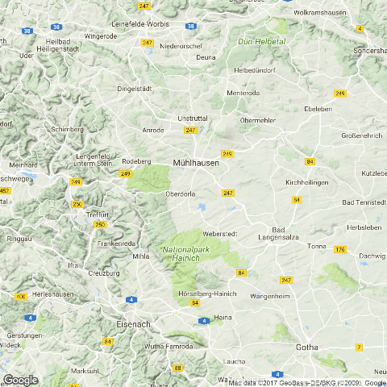

- Wir brauchen ein anderes *zoom level*

# Ein anderes *zoom level*

- level 3 - Kontinent
- level 10 - Stadt
- level 21 - Gebäude


```r
qmap("Germany", zoom = 6)
```

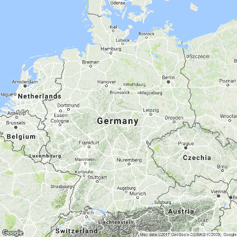


# Karte für eine Sehenswürdigkeit

- `ggmap` - maptype satellite


```r
WIL <- qmap("Wilhelma",zoom=20, maptype="satellite")
WIL
```

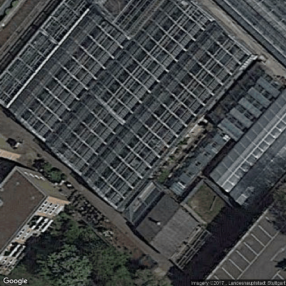

# `ggmap` - maptype satellite zoom 20


```r
qmap('Stuttgart Hauptbahnhof', zoom = 15, maptype="hybrid")
```

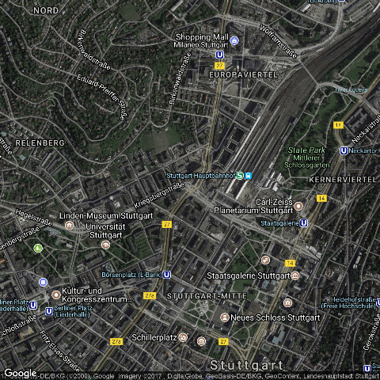

# Eine terrain Karte


```r
qmap('Stuttgart Fernsehturm', zoom = 14,
 maptype="terrain")
```

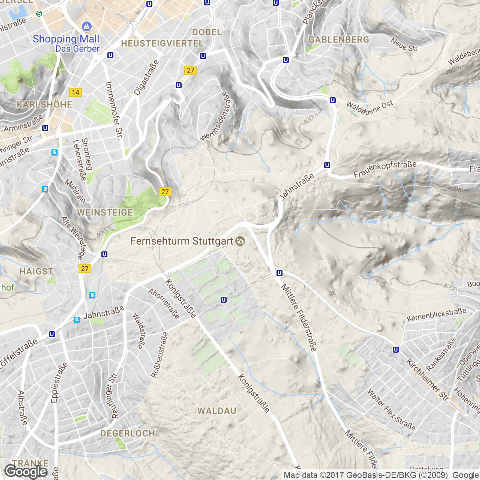

# `ggmap` - maptype watercolor


```r
qmap('Stuttgart', zoom = 14,
 maptype="watercolor",source="stamen")
```

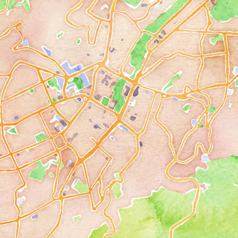

# `ggmap` - source stamen


```r
qmap('Stuttgart', zoom = 14,
 maptype="toner",source="stamen")
```

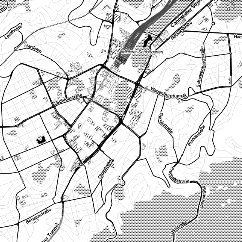

# `ggmap` - maptype toner-lite


```r
qmap('Stuttgart', zoom = 14,
 maptype="toner-lite",source="stamen")
```

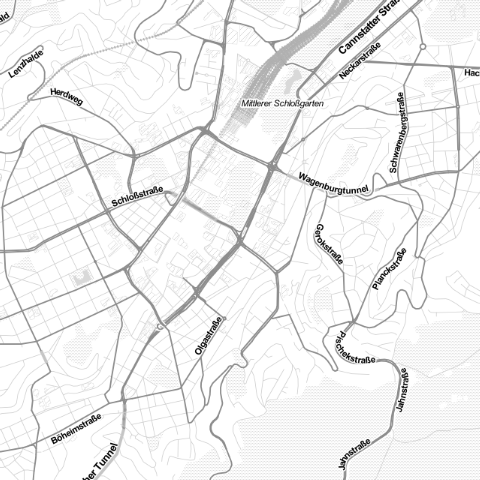
# `ggmap` - maptype toner-hybrid


```r
qmap('Stuttgart', zoom = 14,
 maptype="toner-hybrid",source="stamen")
```

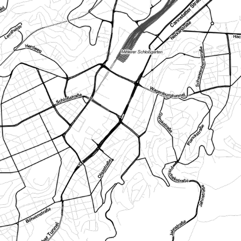

# `ggmap` - maptype terrain-lines


```r
qmap('Stuttgart', zoom = 14,
 maptype="terrain-lines",source="stamen")
```

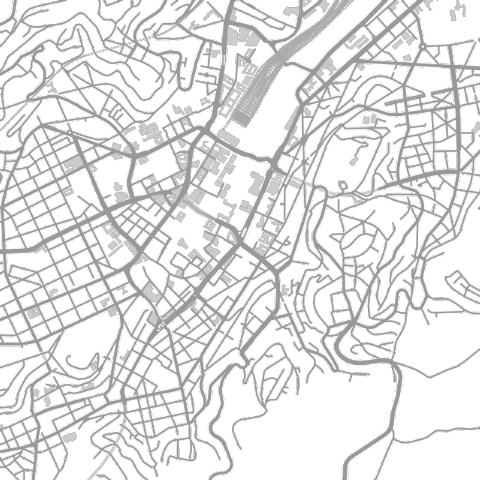


# Geokodierung

> Geocoding (...) uses a description of a location, most typically a postal address or place name, to find geographic coordinates from spatial reference data ... 

[Wikipedia - Geocoding](https://github.com/adam-p/markdown-here/wiki/Markdown-Cheatsheet#blockquotes)


```r
library(ggmap)
geocode("Stuttgart")
```

```
##        lon      lat
## 1 9.182932 48.77585
```


# Reverse Geokodierung

> Reverse geocoding is the process of back (reverse) coding of a point location (latitude, longitude) to a readable address or place name. This permits the identification of nearby street addresses, places, and/or areal subdivisions such as neighbourhoods, county, state, or country.

Quelle: [Wikipedia](https://en.wikipedia.org/wiki/Reverse_geocoding)


```r
revgeocode(c(48,8))
```

```
## [1] "Unnamed Road, Somalia"
```


# Die Distanz zwischen zwei Punkten


```r
mapdist("Marienplatz Stuttgart","Hauptbahnhof Stuttgart")
```

```
##                    from                     to    m    km   miles seconds
## 1 Marienplatz Stuttgart Hauptbahnhof Stuttgart 3136 3.136 1.94871     488
##    minutes     hours
## 1 8.133333 0.1355556
```


```r
mapdist("Marienplatz Stuttgart","Hauptbahnhof Stuttgart",
        mode="walking")
```

```
##                    from                     to    m    km    miles seconds
## 1 Marienplatz Stuttgart Hauptbahnhof Stuttgart 2505 2.505 1.556607    1874
##    minutes     hours
## 1 31.23333 0.5205556
```


# Eine andere Distanz bekommen


```r
mapdist("Marienplatz Stuttgart","Hauptbahnhof Stuttgart",
        mode="bicycling")
```

```
##                    from                     to    m    km    miles seconds
## 1 Marienplatz Stuttgart Hauptbahnhof Stuttgart 2722 2.722 1.691451     486
##   minutes hours
## 1     8.1 0.135
```

# Geokodierung - verschiedene Punkte von Interesse


```r
POI1 <- geocode("B2, 1 Mannheim",source="google")
POI2 <- geocode("Hbf Mannheim",source="google")
POI3 <- geocode("Mannheim, Friedrichsplatz",source="google")
ListPOI <-rbind(POI1,POI2,POI3)
POI1;POI2;POI3
```

```
##        lon      lat
## 1 8.462844 49.48569
```

```
##        lon      lat
## 1 8.469879 49.47972
```

```
##   lon lat
## 1  NA  NA
```


# Punkte in der Karte


```r
MA_map +
geom_point(aes(x = lon, y = lat),
data = ListPOI)
```

# Punkte in der Karte


```r
MA_map +
geom_point(aes(x = lon, y = lat),col="red",
data = ListPOI)
```


# `ggmap` - verschiedene Farben


```r
ListPOI$color <- c("A","B","C")
MA_map +
geom_point(aes(x = lon, y = lat,col=color),
data = ListPOI)
```

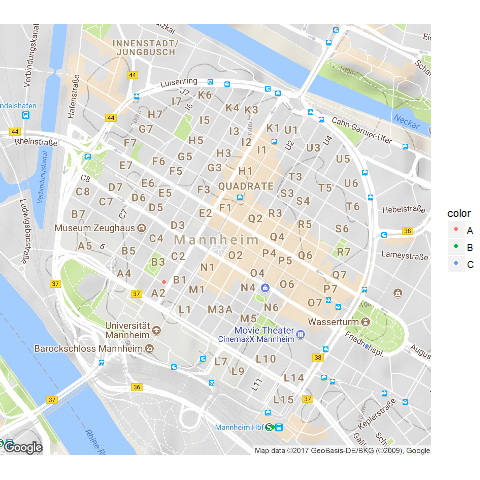

# `ggmap` - größere Punkte


```r
ListPOI$size <- c(10,20,30)
MA_map +
geom_point(aes(x = lon, y = lat,col=color,size=size),
data = ListPOI)
```

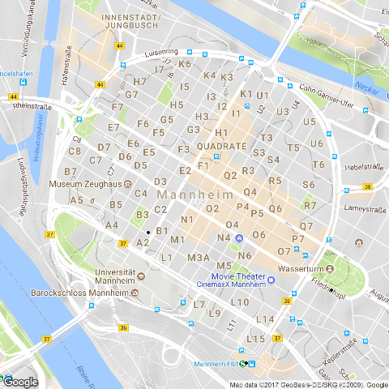

# Eine Route von Google maps bekommen


```r
from <- "Mannheim Hbf"
to <- "Mannheim B2 , 1"
route_df <- route(from, to, structure = "route")
```

[Mehr Information](http://rpackages.ianhowson.com/cran/ggmap/man/route.html)

<http://rpackages.ianhowson.com/cran/ggmap/man/route.html>

# Eine Karte mit dieser Information zeichnen


```r
qmap("Mannheim Hbf", zoom = 14) +
  geom_path(
    aes(x = lon, y = lat),  colour = "red", size = 1.5,
    data = route_df, lineend = "round"
  )
```

<!--

-->
Wie fügt man Punkte hinzu

- Nutzung von [geom_point](http://zevross.com/blog/2014/07/16/mapping-in-r-using-the-ggplot2-package/)


- Question on [stackoverflow](http://stackoverflow.com/questions/15069963/getting-a-map-with-points-using-ggmap-and-ggplot2)

<http://i.stack.imgur.com>

 
# Cheatsheet

- Cheatsheet zu [data visualisation](https://www.rstudio.com/wp-content/uploads/2015/04/ggplot2-cheatsheet.pdf)

<https://www.rstudio.com/>

<!--

-->


# Das Paket `ggmap`


```r
library(ggmap)
lon_plz <- PLZ_SG@data[which.max(PLZ_SG$bakery),"lon"]
lat_plz <- PLZ_SG@data[which.max(PLZ_SG$bakery),"lat"]
mp_plz <- as.numeric(c(lon_plz,lat_plz))
qmap(location = mp_plz,zoom=15)
```

 


# Das Paket `osmar`


```r
library(osmar) 
```


```r
src <- osmsource_api()
gc <- geocode("Stuttgart-Degerloch")
bb <- center_bbox(gc$lon, gc$lat, 800, 800)
ua <- get_osm(bb, source = src)
plot(ua)
```

 

# Gebäude in diesem Ausschnitt plotten


```r
bg_ids <- find(ua, way(tags(k=="building")))
bg_ids <- find_down(ua, way(bg_ids))
bg <- subset(ua, ids = bg_ids)
bg_poly <- as_sp(bg, "polygons")  
plot(bg_poly)
```

 

# Gebäude und Straßen im Ausschnitt

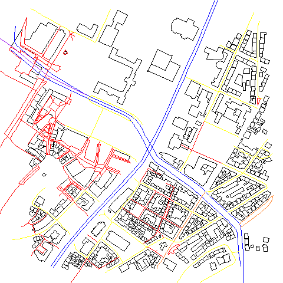

<!--
Interaktive Karten
http://rmaps.github.io/
-->

# Schlussfolie

Vielen Dank für die Aufmerksamkeit


# Erweiterungsmöglichkeiten

- Interaktive Karten mit dem Paket `leaflet`

http://rpubs.com/Japhilko82/Rleaflet


- Die Nutzung der Overpass API mit R


http://rpubs.com/Japhilko82/NutzungOverpassR


<!--
xxxxtodo: Point in Polygon Methode
-->

# [Karte auf Carto zur Energieerzeugung](https://japhilko.carto.com/viz/f31db8c4-8f7d-11e5-b394-0ef7f98ade21/public_map)

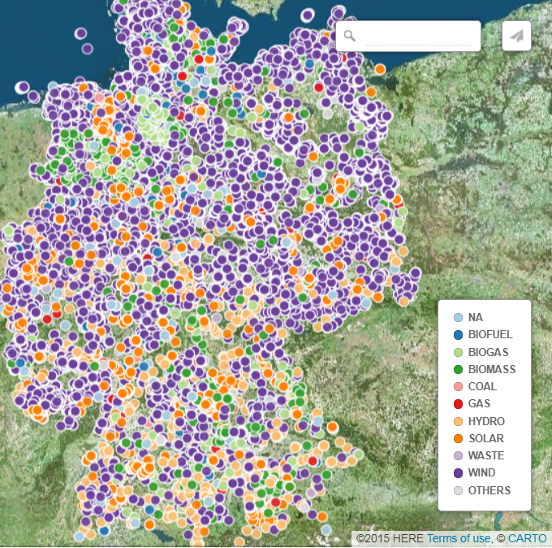
